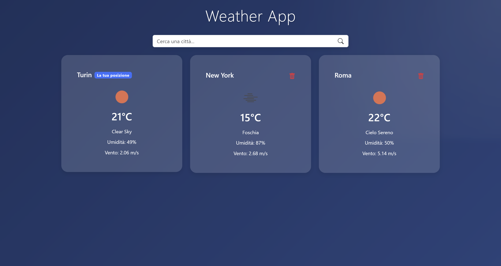

# WeatherApp

# Refactoring 2.0



## Descrizione

WeatherApp è un'applicazione meteo moderna sviluppata con React e Vite che permette agli utenti di visualizzare le previsioni meteo attuali per diverse città. Questo progetto è un refactoring di un'applicazione React precedente, migliorato con animazioni fluide, una struttura dei componenti più efficiente e un'esperienza utente ottimizzata.

## Funzionalità Principali

- **Ricerca di città**: Cerca qualsiasi città nel mondo con suggerimenti in tempo reale
- **Geolocalizzazione**: Rileva automaticamente la posizione dell'utente
- **Dashboard personalizzata**: Visualizza le città salvate con le loro condizioni meteo attuali
- **Dettagli meteo completi**: Temperatura, umidità, velocità del vento e stato del cielo
- **Previsioni grafiche**: Visualizzazione grafica dell'andamento del meteo
- **Animazioni fluide**: Utilizzo di Framer Motion per transizioni ed effetti visivi
- **Responsive design**: Adattabilità a qualsiasi dispositivo

## Tecnologie Utilizzate

- React 18
- Vite 6
- React Router 6
- React Bootstrap 
- Chart.js per visualizzazioni grafiche
- Framer Motion per animazioni
- API OpenWeatherMap

## Struttura dell'Applicazione

L'applicazione è organizzata nei seguenti componenti principali:

- **App.jsx**: Componente principale che gestisce il routing e lo stato dell'applicazione
- **SearchCity.jsx**: Gestisce la ricerca delle città con suggerimenti in tempo reale
- **CityList.jsx**: Visualizza l'elenco delle città salvate
- **CityCard.jsx**: Card per mostrare le informazioni meteo di base di una città
- **SingleCity.jsx**: Visualizzazione dettagliata del meteo di una singola città
- **NextDays.jsx**: Mostra le previsioni per i giorni successivi
- **GraphicWeather.jsx**: Visualizzazione grafica dell'andamento meteo
- **ErrorConnect.jsx**: Gestione degli errori di connessione o API

## Logica dell'Applicazione

L'applicazione utilizza un approccio basato su componenti con gestione dello stato locale e localStorage per la persistenza dei dati. Il flusso di lavoro è il seguente:

1. All'avvio, l'app verifica se ci sono città salvate nel localStorage
2. L'utente può decidere se condividere la propria posizione per ottenere il meteo locale
3. L'utente può cercare una città tramite la barra di ricerca
4. Le città selezionate vengono aggiunte alla dashboard principale
5. Cliccando su una città si accede alla vista dettagliata con previsioni complete
6. Le città possono essere eliminate dalla dashboard

I dati meteo vengono recuperati tramite l'API OpenWeatherMap e visualizzati in tempo reale.

## Come Iniziare

```bash
# Clona il repository
git clone <repository-url>

# Installa le dipendenze
npm install

# Crea un file .env con la tua API key di OpenWeatherMap
VITE_W_KEY=la_tua_api_key

# Avvia il server di sviluppo
npm run dev
```

## Miglioramenti rispetto alla versione precedente

Questa versione include diversi miglioramenti:
- Utilizzo di Vite invece di Create React App per prestazioni migliori
- Animazioni fluide con Framer Motion
- Gestione più efficiente degli stati e delle API
- Migliore organizzazione dei componenti
- Design più moderno e responsivo
